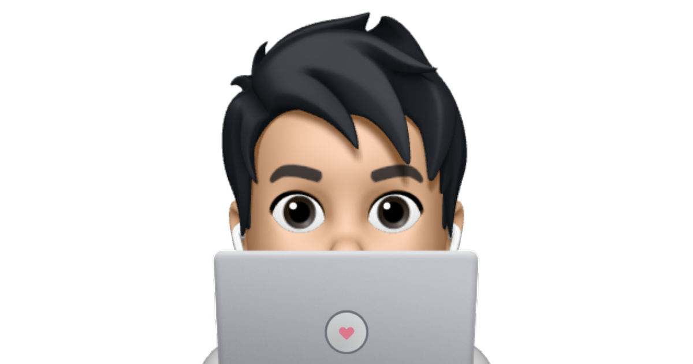

<div align="center" id="top"> 
  

  <a href="https://danydodson.dev">Demo</a>  
</div>

<h1 align="center">danydodson_</h1>
<!-- "graphql": {
    "schema": [
      "./cache/schema.graphql",
      ".cache/schema.gql"
    ],
    "documents": [
      "**/**/*.{graphql,js,jsx}",
      ".cache/fragments.graphql"
    ],
    "extensions": {
      "endpoints": {
        "default": {
          "url": "http://localhost:8000/___graphql"
        }
      }
    }
  } -->
<p align="center">
  <a href="https://wakatime.com/badge/github/danydodson/danydodson_"></a>
  <a href="https://wakatime.com/badge/user/5f103765-30df-4813-b3e9-28120f0a5e6a/project/65c9f940-4604-4bed-8d1e-6e41c2de1eb1"></a>
  
  
  
  
  
  
  
</p>

<p align="center">
  <a href="#dart-about">About</a> &#xa0; | &#xa0; 
  <a href="#sparkles-features">Features</a> &#xa0; | &#xa0;
  <a href="#rocket-technologies">Technologies</a> &#xa0; | &#xa0;
  <a href="#white_check_mark-requirements">Requirements</a> &#xa0; | &#xa0;
  <a href="#checkered_flag-starting">Starting</a> &#xa0; | &#xa0;
  <a href="#memo-license">License</a> &#xa0; | &#xa0;
  <a href="https://github.com/danydodson" target="_blank">Author</a>
</p>

<br>

## 🎯 About

Portfolio & Blog

## ✨ Features

✔️ Feature 1;\
✔️ Feature 2;\
✔️ Feature 3;

## 🚀 Technologies

The following tools were used in this project:

- [Gatsby](https://www.gatsbyjs.com//)
- [React](https://pt-br.reactjs.org/)
- [Node.js](https://nodejs.org/en/)
- [Mdx](https://mdxjs.com/)
- [TailwindCSS](https://tailwindcss.com/)
- [Twin](https://github.com/ben-rogerson/twin.macro/)
- [Emotion](https://emotion.sh/docs/introduction/)

## ✅ Requirements

Before starting 🏁, you need to have [Git](https://git-scm.com) and [Node](https://nodejs.org/en/) installed.

## 🏁 Starting

```bash
# Clone this project
$ git clone https://github.com/danydodson/danydodson_

# Access
$ cd danydodson_

# Install dependencies
$ yarn

# Run the project
$ yarn start

# The server will initialize in the <http://localhost:8000>
```

## 📝 License

This project is under license from MIT. For more details, see the [license](license.md) file.

Made with ❤️ by <a href="https://github.com/danydodson" target="_blank">Dany Dodson</a>

&#xa0;

<a href="#top">Back to top</a>
